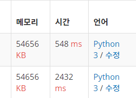

# 백준

## 11725

- 에러 1

1이 루트 노드이므로 입력 숫자 두개 중에 1이 있으면 1이 아닌 숫자의 부모를 1로 한다. 

1이 없으면 재귀적으로 1을 찾아서 둘 중 1이 먼저 나오는 숫자가 상위에 있는 것이므로 해당 숫자를 다른 숫자의 부모로 설정했다.

recursion error 발생

- 에러 2

recursion의 기본 횟수가 1000으로 지정되어 있어서 recursionlimit을 증가시켰으나 시간 초과

- 통과 1

입력 받는 숫자들을 가지고 매번 부모 노드를 조회하기 보다는 각 입력 숫자별로 자신과 연결된 숫자들을 딕셔너리 형태로 저장했다. 이러면 개별적으로 탐색하던 방식에서 각 숫자별로 자신과 연결된 모든 숫자들을 탐색해나가는 방식으로 바꿀 수 있다.

DFS를 1부터 돌면서 부모 숫자를 바꿔나간다. 처음에 1이 돌때 자신과 연결된 모든 숫자는 자신의 자식 노드가 된다. 이후 자식 노드들은 자신들과 연결된 숫자들을 자식 노드들로 바꿔나간다.

1의 자식 노드는 visited 배열에서 방문 체크가 되기 때문에 자신과 연결된 숫자들은 1의 자식 노드가 아니라면 모두 자신의 자식 노드가 된다.

- 통과 2

시간 개선을 위해서 not in 연산을 제거했다. 후보 노드에 설령 중복으로 올라간다고 하더라도 어차피 visited 배열로 방문 체크를 하기 때문에 거를 수 있다. 메모리 사용량은 같았으나 시간은 4배 이상 빨라졌다.

이미지의 아래 결과가 '통과1' , 위가 '통과2'다.

