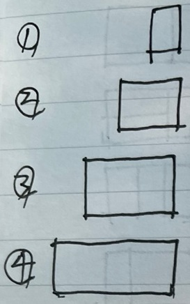
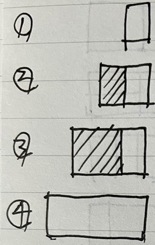

# 동적계획법 (타일링 알고리즘)

## 이것이 코딩테스트다 p. 223

나동빈님의 ''이것이 코딩테스트다''를 학습하면서 다이나믹 프로그래밍 챕터에서 타일링 문제를 접하게 됐다. 유독 이 문제가 잘 이해가 되지 않아서 이해하는데 한참(~~몇일~~) 걸렸다.

문제는 [백준 11727번](https://www.acmicpc.net/problem/11727)과 같은 타일링 방식(타일의 종류가 3개 - 1 X 2, 2 X 1, 2 X 2)이다.

점화식으로 나타내면 d[n] = d[n - 1] + 2 * d[n - 2] 다.

이 점화식을 계속 받아들이지 못했었다. 타일링에 대한 설명이 1개 부터 채워나가는게 아니라 거의 다 채워서 1칸과 2칸만 남았다는 상황에서 이루어졌다. 

이렇게 되면 다 채웠을 경우가 n이고, 1칸 남으면 n - 1, 2칸 남으면 n - 2다. n - 1에서는 2 X 1 하나 밖에 쓸 수 없어서 방법이 1개 이고, n - 2에서는 1 X 2 를 두개를 하거나 2 X 2를 쓰는 2가지 방법이 있다. 

물론 2 X 1을 두 개를 쓸 수도 있지만 이는 n - 1에서 고려된 방식(n - 1에서 쓴 2 X 1을 1가지 방법이라고 하면 여기서 2 X 1 타일을 하나 더 붙이기만 하는 거라 결국 공통의 1가지 방법으로 봐야 한다)이라 n - 2에서는 또 고려하지 않는다.

n을 채우기 위해서는 1개의 n - 1과 2개의 n - 2이 필요해서 d[n] = d[n - 1] + 2 * d[n - 2] 라는 점화식이 도출되게 된다.

문제는 여기서부터 시작됐다(다른 분들의 설명이 잘못된게 아니라 내가 이해를 못한 것이다). 이 점화식에 숫자를 대입해서 생각해보면, n이 3이라고 했을때 n - 1은 2고 n - 2는 1이 된다. 그런데 점화식에 따라서는 2는 방법이 1가지고 1은 방법이 2가지가 되는건데 실제로 2가 방법이 2가지고 1은 방법이 1가지다. 이렇게 생각하면서 계속 꼬이게 됐다.

한참 이해를 못하다가 bottom-up과 top-down을 보게 되면서 뭔가 깨달은 듣한 느낌이 왔다. 위에서 설명한 방법은 top-down 형식으로 다 채워지는 경우에서 점점 아래로 내려갔다면, 내가 이해하려고 한 방식은 1개부터 2개, 3개 점점 커지면서 타일을 다 채우는 bottom-up 방식이었다.

 

다 채웠을 경우를 n이라고 하면 n - 1이 이미지의 1, n - 2가 이미지의 2... 이렇게 된다.

점화식에 따르면 n - 1을 채우려면 n - 2와 2 * (n - 3) 이 필요하다.

 

n - 2에서 n - 1로 채우는데 가로로 1칸만 있으면 되기 때문에 2 X 1 타일로 채울 수 있다.

n - 3에서 n - 1로 채우는데 가로로 2칸 있으면 되기 때문에 1 X 2를 2개를 사용하는 방법과 2 X 2를 1개 사용하는 방법으로 2가지 방법이 있다.

n - 1에서도 n - 2는 1가지 방법, n - 3은 2가지 방법이 있다.

 

<참고>

https://blog.naver.com/PostView.nhn?blogId=ndb796&logNo=221233586932&parentCategoryNo=&categoryNo=128&viewDate=&isShowPopularPosts=false&from=postView

https://susufana.tistory.com/85?category=961426

https://www.acmicpc.net/problem/11727