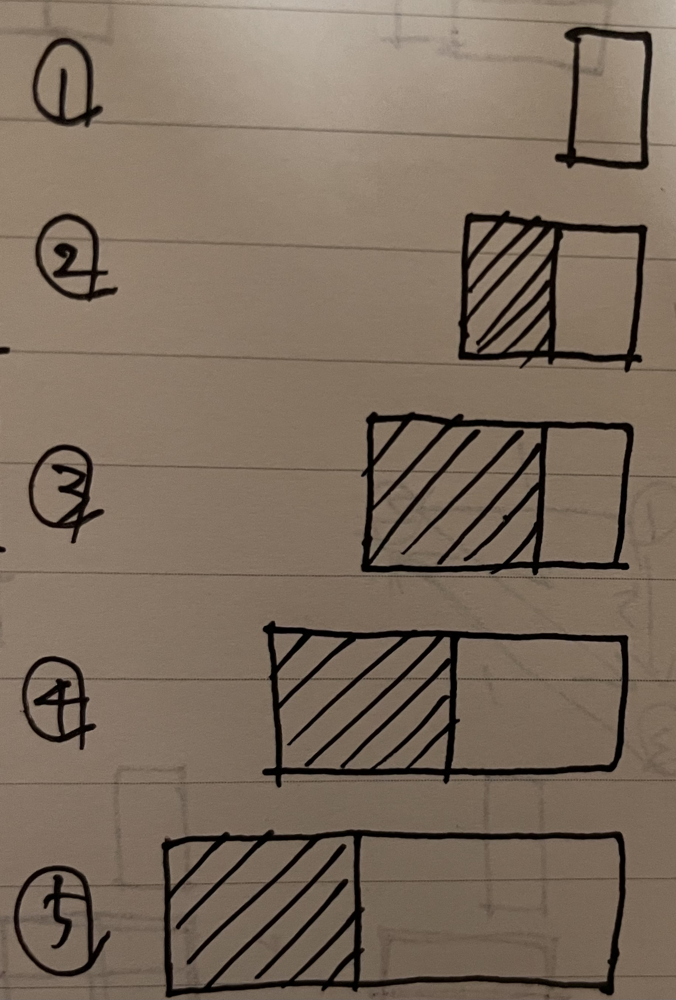
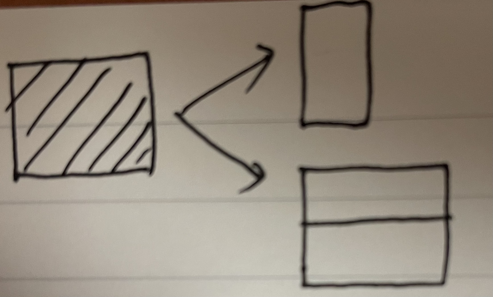

# 백준

## 11726

다이나믹 프로그래밍 문제다.

이전에 다이나믹 프로그래밍의 타일링 알고리즘과 관련해서 [정리](https://github.com/Gyusik-Choi/Algorithm/blob/master/Algorithm/DP/%EB%8F%99%EC%A0%81%EA%B3%84%ED%9A%8D%EB%B2%95%20%ED%83%80%EC%9D%BC%EB%A7%81/%EB%8F%99%EC%A0%81%EA%B3%84%ED%9A%8D%EB%B2%95%20(%ED%83%80%EC%9D%BC%EB%A7%81%20%EC%95%8C%EA%B3%A0%EB%A6%AC%EC%A6%98).md)를 한 것과 유사한 문제다.

이 문제도 최대 가로로 2칸 까지 타일을 한번에 채울 수 있다. 채워야 할 칸 수가 n이라면 n을 채울 수 있는 방법에 n - 1을 채우는 방법과, n - 2를 채우는 방법이 영향을 줄 수 있음을 알 수 있다.

 

위의 이미지처럼 3칸을 채우는 경우부터 기존에서 최대 2칸을 채울 수 있다. 2칸을 채우는 경우는 이전에 1칸에서 1칸을 더 채우는 경우라 최대 1칸까지만 추가할 수 있기 때문이다.

3칸을 채우는 경우를 n = 3이라고 하자. n = 3은 n - 1인 2, n - 2인 1이 영향을 줄 수 있다. 

2에서는 1칸만 추가되는 경우고, 1에서는 2칸이 추가되는 경우다.

 

1칸만 추가될 경우에는 2 X 1 타일 1개를 사용하는 1개의 방법이 있다. 2칸이 추가될 경우에는 2 X 1을 추가하는 경우가 앞에서 고려됐고 이 경우에는 1 X 2를 사용할 수 없어서 결국 1 X 2 를 2개 사용하는 1개의 방법이 있다.

그래서 n - 1을 채우는 방법과 n - 2를 채우는 방법을 합해주면 n을 채우는 방법을 구할 수 있다.

 

<참고>

https://blog.naver.com/PostView.nhn?blogId=ndb796&logNo=221233586932&parentCategoryNo=&categoryNo=128&viewDate=&isShowPopularPosts=false&from=postView

