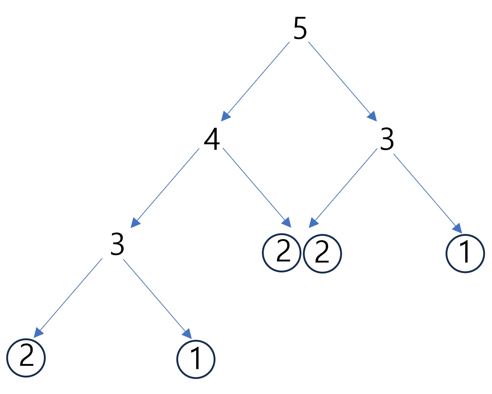

# 백준

## 24416

코드1의 경우 문제에서 주어지는 수도 코드를 그대로 구현하면 시간 초과가 발생한다. 코드1을 재귀 대신 동적 프로그래밍으로 구현했다. 

코드1은 1 혹은 2를 인자로 함수 호출한 횟수의 총합을 구하면 된다. 즉, n 의 피보나치 수를 구하는 것과 같다.

n 의 피보나치 수는 n - 1 의 피보나치 수와 n - 2 의 피보나치 수를 더한 값과 같다. 

1, 2는 피보나치 수가 1로 고정되어 있다. 

3은 n - 1인 2 와 n - 2 인 1을 더한 2가 피보나치 수가 된다. 

4는 3과 2의 피보나치 수를 더한 값이 되는데 3의 경우 앞서 구한 2가 되고, 2는 1이라 이를 더한 3이 피보나치 수가 된다. 

5의 경우 아래의 그림을 참고할 수 있다. 트리의 맨 하단에 1, 2가 위치하고 1, 2의 총 갯수가 5다.

 

3이상의 숫자의 경우 n - 2, n - 1 을 반복 호출하면서 2 혹은 1을 만날 때까지 반복하게 되고 이들의 총 갯수를 구한게 피보나치 수가 된다.

이를 재귀 호출 대신 보다 빠르게 답을 구하기 위해 동적 프로그래밍을 활용한다. 1, 2를 찾을 때까지 반복적으로 재귀 호출을 하지 않는다. 이미 기존에 구한 값은 다시 구하지 않고 구해둔 값을 활용한다.

리스트와 딕셔너리 둘 다 가능하며 1, 2 의 값은 1로 미리 설정한다. 그리고 3부터 n까지 for 문을 돌면서 for 문의 요소 - 1 의 값과 for 문의 요소 - 2 의 값을 더한 값을 해당 요소의 값으로 설정한다. 

오름차순으로 구하기 때문에 3을 구하면 4는 이미 구한 3과 2를 활용해서 답을 구할 수 있다. 5의 경우도 마찬가지로 이미 구한 4와 3의 값을 그대로 활용할 수 있다.

 

코드2의 경우 동적 프로그래밍을 활용하는 수도 코드가 나온다. 이 수도 코드는 코드1과 마찬가지로 n 이 1 혹은 2일 경우 1을 리턴한다. 3이상인 경우 3부터 n까지 for 문을 돌면서 피보나치 수를 구한다.

문제의 입력은 5이상, 30이하의 숫자가 주어진다. 입력이 5이상이므로 n 이 1, 2인 경우는 주어지지 않는다. for 문을 도는 입력만 주어진다. for 문을 도는 횟수가 코드2의 실행 횟수가 된다. 3은 1번, 4는 2번, 5는 3번 이렇게 답이 나오므로 n - 2 를 리턴하면 된다.

 

<참고>

https://www.acmicpc.net/board/view/125928

https://papapapa.tistory.com/27

https://dduniverse.tistory.com/entry/%EB%B0%B1%EC%A4%80-24416-%EC%95%8C%EA%B3%A0%EB%A6%AC%EC%A6%98-%EC%88%98%EC%97%85-%ED%94%BC%EB%B3%B4%EB%82%98%EC%B9%98-%EC%88%98-1-%ED%8C%8C%EC%9D%B4%EC%8D%AC-python

