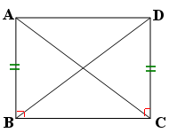

# 백준

## 9663

### 풀이1 

세로, 대각선1, 대각선2 배열을 만들어서 체크했다.

n-queen 문제에서 퀸을 공격할 수 없게 하려면 퀸과 같은 가로 선상에 있으면 안되고, 같은 세로 선상에 있으면 안되고, 같은 두 대각선의 선상에 있으면 안 된다. 

같은 가로 선상에 있는지 여부는 함수의 인자로서 세로축의 값을 1씩 더해가기 때문에 겹치지 않는다. 세로축이라고 했는데 같은 가로 선상에 있는 것은 방향은 행이지만 가로 선상 여부를 결정하는 값은 y축 값이다. y축 값이 같으면 x축 값이 무엇이든 같은 가로 선상에 있게 된다.

같은 세로 선상에 있는지 여부는 N 만큼의 길이로 하는 1차원 배열 vertical을 통해 체크한다. 1차원 배열로 만들어서 N의 요소 하나가 같은 세로 방향에 위치한 N개의 요소를 체크하게 된다. for문의 값으로 같은 세로 선상 여부를 판단한다. x축 값으로 판단한다. (0, 0)을 방문하면 vertical 배열의 0번째 요소를 1로 바꿔준다. 이러면 (1, 0), (2, 0) ...(N-1, 0) 은 방문할 수 없다.

대각선의 길이는 2*N - 1개다. 즉 N이 1이면 1, 2면 3, 3이면 5, 4면 7 이다. 세로와 마찬가지로 두 방향의 대각선을 체크할 수 있는 1차원 배열 diagonal1, diagonal2를 만든다. 대각선의 방향은 아래와 같다. 아래를 기준으로 A에서 C 방향은 (0, 0), (1, 1), (2, 2) 혹은 (1, 0), (2, 1), (3, 2) 등등 같은 대각선 선상에 있는 점들은 가로와 세로의 차이가 같다. 이를 수식화하면 N + x - y - 1 이런 형태가 된다. 다른 대각선인 D에서 B 방향은 (3, 0), (2, 1), (1, 2), (0, 3) 등등 이런 식으로 같은 대각선 선상에 있는 점들은 가로와 세로의 합이 같다. 이를 수식화하면 x + y 이런 형태가 된다.

같은 세로, 같은 대각선1, 같은 대각선2 선상에 있지 않으면 해당 요소들을 1로 바꿔서 방문 체크한 후에 함수의 인자로 쓰이는 y축 값을 1증가시켜서 재귀적으로 돈다. 하나의 재귀 함수 싸이클에서는 가로 방향으로 하나의 값을 결정하게 된다. n-queen의 가능성이 있는 값으로 여겨지면 다음 가로 방향의 값 중에 유망한 값을 결정하고 계속해서 이어가다가 만약에 N만큼 y축 값이 늘어나면 n-queen의 갯수를 세는 값의 변수를 1증가시켜준다.

만약에 중간에 유망하지 않은 값으로 결정되면 그 다음 가로 방향을 더 검사하지 않고 종료시킨다. 이것을 통해서 재귀함수에서 발생하는 비효율성을 개선할 수 있다.

 

### 풀이 2

가로, 세로, 대각선1, 대각선2 방향으로 겹치지 않는 것을 찾는 것은 기본적으로 풀이 1과 동일하다. 다만 이 풀이는 풀이1과 다르게 하나의 재귀함수 싸이클에 가로 방향으로 하나의 값을 결정하는게 아니라 세로 방향으로 하나의 값을 결정한다. 물론 가로 방향으로 값을 결정해도 상관없다. 세로인지 가로인지가 중요하기 보다는 그 방향에 맞춰 유망한 요소인지 체크하는 것을 잘 하는게 중요하다(자바 코드로는 풀이 1처럼 가로 방향을 기준으로 진행했다).

세로 방향으로 하나의 값을 결정하기 위해 row 배열의 해당하는 인덱스의 값을 직접 0부터 N-1까지 바꿔가면서 검사한다. row 배열의 값은 기본적으로 모두 달라야 한다. row 배열의 인덱스는 y축 값을 나타내고 그 인덱스의 값은 x축의 값을 나타낸다. 그렇기 때문에 같은 값이 나오면 n-queen이 될 수 없다.

check 함수에서는 row 배열의 값이 0부터 x까지의 인덱스 값이 같은지 체크하고 다르다면 추가적으로 대각선 방향을 검사하기 위해 풀이 1과 다른 방식으로 점검한다. 이 방식은 다른 분들의 코드를 참고해서 작성했다. 생각하지 못했던 방식이라 방식을 이해하고서 감탄할 수 밖에 없었다. 예를 들어 (1, 1), (2, 2) 가 있다고하면 check 함수에서 첫번째 검사를 하는 if row[x] == row[y]: 이 코드에서는 걸리지 않는다. row[y]의 값은 1이고 row[x]의 값은 2이기 때문이다. 그러나 그 다음 검사에서 걸리게 된다. if abs(row[x] - row[y]) == x - y: 이 코드를 통해 걸러내게 되는데 각 요소의 y축 값끼리, x축 값끼리 빼서 더하면 걸러내는 방식이다. 만약에 (1, 1), (2, 3) 이라면 abs(row[x] - row[y]) 는 2이고 x - y는 1이 된다. 같은 대각선에 있지 않다. 풀이 1에서 대각선 두 방향을 모두 점검했던 것에 비해 간결해졌다.

 

### 특이점

파이썬으로는 풀이1이 통과하지 못했고 pypy로도 통과하지 못했으나 자바와 자바스크립트(node)로는 통과했다. 자바의 경우 이 문제 전체 백준 자바코드에서 6번째로 빠른 코드였고 노드의 경우 3번째로 빠른 코드였다.

자바로는 풀이2 방식이 풀이1보다 2배 가까이 느렸다.

 

참고

https://mathbang.net/146

https://st-lab.tistory.com/118

https://pacific-ocean.tistory.com/338