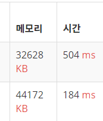

# 백준

## 11729

파이썬의 heapq 모듈을 활용해서 풀이했다. 먼저 간단하게 heapq 모듈의 활용법을 알아보겠다.

```python
import heapq
# heapq 를 import 해서 사용할 수 있다.

heap = []
# heapq 의 결과값들을 모을 빈 배열을 만든다.

heapq.heappush(heap, 1)
# heapq 모듈의 heappush 메소드를 통해 heap에 원소 추가할 수 있다.

heapq.heappop(heap)
# 원소를 heap에서 꺼낼 수 있다. heapq는 최소힙 형태로 구현돼서 heap의 최소값이 꺼내진다.

```


heapq 모듈은 최소힙 형태로 구현되기 때문에 이번 문제를 풀이하려면 최대힙을 활용해야 한다.  heapq의 연산에서 우선 순위를 설정하는 부분에서 변화를 주면 가능하다.


```python
import heapq

heap = []

heapq.heappush(heap, (2, 'B'))
heapq.heappush(heap, (1, 'A'))

# 위의 2와 1은 우선순위를 정하는 부분이다.
# heap 을 출력하면 1, 2 가 나온다.
```


우선 순위를 직접 설정할 수 있기 때문에 문제의 입력이 예를 들어 1, 2, 3일때 우선순위를 입력 숫자의 음수 형태로 넣는다면 -1, -2, -3으로 들어간다. 그러면 지정한 우선 순위에 따라서 힙에는 3, 2, 1 순서로 저장될 것이다. 즉 0 이상의 경우에 숫자가 클수록 음수로 변환한 값은 낮기 때문에 높은 우선 순위를 갖고 힙에서 앞 부분에 놓이게 돼서 최대힙 형태로 활용할 수 있다.




최대힙을 직접 구현해서 풀이를 해보았을 때, 메모리는 줄었으나 시간은 3배 가까이 더 걸렸다.


참고

https://www.daleseo.com/python-heapq/

