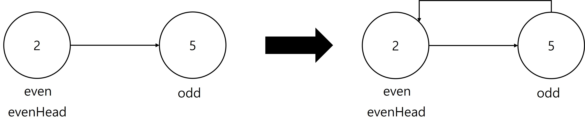

# LeetCode

## 328. Odd Even Linked List

### Python

처음에 head 와 odd 가 같은 노드를 바라본다. odd 는 계속 이동하지만 head 는 변하지 않는다. odd 가 맨 첫 노드를 더 이상 보고 있지 않아도 head 가 계속 맨 첫 노드를 보고 있다. head 가 맨 첫 노드를 계속 바라보고 있어서 odd 가 변경시킨 노드 연결 관계를 head 를 통해서 볼 수 있다.

even_head 와 even 도 head 와 odd 의 경우처럼 처음에 같은 노드를 바라보다가 even 은 계속 이동하지만 even_head 는 변하지 않는다. even_head 를 통해서 even 이 변경시킨 노드 연결 관계를 even_head 를 통해서 볼 수 있다.

head 와 odd, even_head 와 even 이 각각 쌍으로 구성된다. 쌍마다 각자 노드 시작부분 유지와 노드 연결관계 변경을 담당한다.

 

### Java

#### OddEvenLinkedList328

재귀를 활용했다.

ListNode 가 null 이거나 ListNode 의 next 가 null 일 때까지 현재 노드의 다음 다음 노드를 재귀호출한다. ListNode 가 null 이거나 ListNode 의 next 가 null 인 조건을 만족하면 배열에 node 와 null 을 담아서 리턴한다. 배열의 0번 인덱스는 홀수노드, 1번 인덱스는 짝수노드가 된다.

현재 노드와 0번 인덱스를 연결하고 다음 노드와 1번 인덱스를 연결한다. 그리고 다시 현재 노드와 다음 노드를 배열에 담아 리턴한다.

마지막에는 0번 인덱스와 1번 인덱스를 연결하고 head 를 반환한다.

 

#### OddEvenLinkedList328_2

처음에는 교재의 풀이와 다르게 접근(OddEvenLinkedList328_Circular_Reference)했는데 순환 참조가 발생했다. 

odd 와 even 을 나눠서 while 문을 진행했는데 odd 가 바뀌면서 head 도 바뀌고 head 의 다음 노드를 참조하던 even 도 영향을 주는데 이를 간과했다.

교재의 풀이를 참고하여 while 문을 한번만 돌면서 순환 참조를 해결했다.

 

<참고>

파이썬 알고리즘 인터뷰

