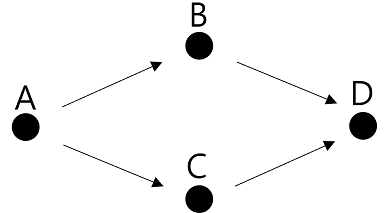
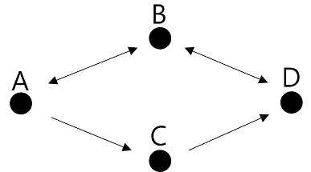

# LeetCode

## 332. Reconstruct Itinerary

### Python

DFS 재귀를 활용했다.

<br>



<br>



단방향, 양방향 탐색의 차이를 생각해볼 수 있었다.

"파이썬 알고리즘 인터뷰" 교재의 풀이처럼 DFS 재귀로 탐색하다 더 이상 탐색할 곳이 없으면 방문 리스트에 추가하고 이를 역순으로 뒤집는 방법을 사용할 경우 맨 마지막 방문 지점은 잘 찾되 그 직전 지점은 순서대로 못찾는게 아닌가 했다.

위의 예시처럼 단방향 그래프를 기준으로 생각하면서 혼동했다. 문제에서는 양방향이 포함돼서 모두 연결된 그래프가 주어진다. 

첫번째 예시처럼 모두 단방향이면서 양갈래 길이 있으면 문제에서 요구하는 조건을 충족할 수 없는 그래프다. 단방향이라 A -> B -> D 를 갔다가 더 이상 탐색을 이어갈 수 없다. C 를 탐색할 방법이 없다.

B, C 두 노드에서 D 로 갈 수 있는데 단방향의 경우 B 를 거쳐서 D 를 방문하면 교재의 코드대로 리스트에 넣게 될 경우 D 를 넣은 후 B 를 넣는데 여기서 다시 혼동한게 C 가 그 다음 방문지라고 생각을 했는데 문제에서 요구하는 올바른 그래프도 아닐뿐더러 C 는 방문할 수가 없었다.

착각한 방문 리스트는 [D, B, C, A] 고 이를 역순으로 하면 [A, C, B, D] 가 돼서 C 를 B 보다 먼저 방문하는게 되지 않나 생각했지만 아예 문제와 맞지않는 그래프이며 탐색 순서도 착각했다.

두번째 예시처럼 위는 양방향이고 아래는 단방향이면 방문 리스트는 [D, C, B, A] 가 되고 역순으로 하면 [A, B, C, D] 가 된다.

<br>

### Java

어려운 문제였다. 교재의 풀이를 참고해서 재귀를 활용했다.

모든 ticket (출발지와 목적지가 있는 편도 이동) 은 한번만 써야하고 모든 ticket 을 사용해야 한다. 어떤 출발지에서 목적지로 갔을 때, 해당 목적지에서 다시 또 다른 목적지로 이동할 수 있어야 한다. 더 이상의 목적지가 없다면 거기서 종료된다.

<br>

```
tickets = [["JFK", "KUL"], ["JFK", "NRT"], ["NRT", "JFK"]]
```

예를 들어, 위와 같은 tickets 가 주어졌을 때 정답은 "JFK", "NRT", "JFK", "KUL" 이다. 그런데 모든 티켓을 사용하되 한번만 사용하는 것을 제대로 인지하지 못하면 올바른 경로를 찾지 못한다.

"JFK" 는 "KUL", "NRT" 두 목적지로 갈 수 있다. 갈 수 있는 목적지가 2군데 이상이면 알파벳 순서가 낮은 목적지를 우선적으로 방문해야 하는 조건에 맞춰 "KUL" 을 가게 되면 정답을 구할 수 없다. "KUL" 에서 출발하는 ticket 정보가 없어서 더 이상 다른 목적지로 갈 수 없다. ticket 들이 남아있지만 더 이상 쓰지 못하게 된다.

<br>

```java
Map<String, Map<String, Boolean>> visit
```

방문한 곳은 다시 방문하지 않아야 하고, 방문할 곳이 남아있는지도 확인해야 해서 처음에는 방문 정보를 담는 해시맵을 두었으나 이는 문제가 있다. 동일한 ticket 정보가 2개 이상 나올 수 있는데 해시맵으로 방문 정보를 구하려고 하면 키가 동일해서 동일한 ticket 이 아무리 많더라도 하나밖에 담을 수 없다.

visit 해시맵의 값으로 해시맵 대신 리스트를 사용할 수도 있으나 매번 리스트에서 목적지 정보를 O(N) 으로 탐색해야 해서 다른 방법을 사용하고 싶었다. 

<br>

```java
Map<String, PriorityQueue<String>> map
```

교재에서는 이를 상당히 깔끔하게 해결한다. 해시맵의 값으로 우선순위 큐를 사용한다. 우선순위 큐를 사용하면 알파벳 순서로 정렬할 필요도 없어진다. 방문 정보를 별도로 관리하지 않고 우선순위 큐를 값으로 갖는 해시맵 하나로 경로와 방문 정보를 모두 알 수 있다.

출발지를 기준으로 map 에 출발지가 key 로 있고, 출발지 key 의 value 가 존재하면 value 중 하나를 꺼낸다. value 가 우선순위 큐라서 알파벳 순서로 나오게 된다. value 에서 꺼낸 목적지를 출발지로 하는 재귀 함수를 호출해서 여행을 이어나간다.

그러면 앞선 예시처럼 JKF 는 KUL, NRT 두 목적지로 갈 수 있는데 우선순위 큐에서는 KUL 이 먼저 나오게 되므로 결국은 여행을 제대로 할 수 없지 않을까 라고 생각할 수 있다. 더 이상 목적지를 찾을 수 없으면 재귀 함수를 호출할 수 없고 while 문을 나와서 itinerary 리스트에 추가하게 된다. 즉, 맨 마지막에 방문하는 곳이 리스트에 가장 먼저 들어간다. 리스트에 들어가는 순서는 방문 순서와 반대로 이루어진다.

앞선 예시로 살펴보면 JKF 에서 출발해서 KUL, NRT 중에 KUL 을 재귀호출하면 KUL 은 목적지가 없기 때문에 while 문을 빠져나와 itinerary 에 KUL 이 담긴다. 그리고 해당 함수가 끝나고 남은 NRT 로 재귀호출하면 NRT 는 JKF 로 갈 수 있기 때문에 JKF 를 재귀호출한다. JKF 는 KUL, NRT 를 모두 우선순위 큐에서 꺼냈기 때문에 더 이상 방문할 수 있는 목적지가 없다. 그래서 JKF 가 itinerary 에 담기게 된다. 그리고 나서 NRT 도 남은 목적지가 없어서 NRT 가 itinerary 에 담기고 맨 처음 출발지였던 JKF 도 itinerary 에 담기면서 종료된다.

<br>

<참고>

파이썬 알고리즘 인터뷰

자바 알고리즘 인터뷰

