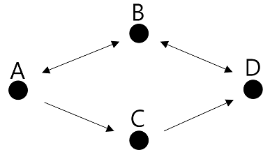

# LeetCode

## 332. Reconstruct Itinerary

DFS 재귀를 활용했다.

 

 

단방향, 양방향 탐색의 차이를 생각해볼 수 있었다.

"파이썬 알고리즘 인터뷰" 교재의 풀이처럼 DFS 재귀로 탐색하다 더 이상 탐색할 곳이 없으면 방문 리스트에 추가하고 이를 역순으로 뒤집는 방법을 사용할 경우 맨 마지막 방문 지점은 잘 찾되 그 직전 지점은 순서대로 못찾는게 아닌가 했다.

위의 예시처럼 단방향 그래프를 기준으로 생각하면서 혼동했다. 문제에서는 양방향이 포함돼서 모두 연결된 그래프가 주어진다. 

첫번째 예시처럼 모두 단방향이면서 양갈래 길이 있으면 문제에서 요구하는 조건을 충족할 수 없는 그래프다. 단방향이라 A -> B -> D 를 갔다가 더 이상 탐색을 이어갈 수 없다. C 를 탐색할 방법이 없다.

B, C 두 노드에서 D 로 갈 수 있는데 단방향의 경우 B 를 거쳐서 D 를 방문하면 교재의 코드대로 리스트에 넣게 될 경우 D 를 넣은 후 B 를 넣는데 여기서 다시 혼동한게 C 가 그 다음 방문지라고 생각을 했는데 문제에서 요구하는 올바른 그래프도 아닐뿐더러 C 는 방문할 수가 없었다.

착각한 방문 리스트는 [D, B, C, A] 고 이를 역순으로 하면 [A, C, B, D] 가 돼서 C 를 B 보다 먼저 방문하는게 되지 않나 생각했지만 아예 문제와 맞지않는 그래프이며 탐색 순서도 착각했다.

두번째 예시처럼 위는 양방향이고 아래는 단방향이면 방문 리스트는 [D, C, B, A] 가 되고 역순으로 하면 [A, B, C, D] 가 된다.

 

<참고>

파이썬 알고리즘 인터뷰

