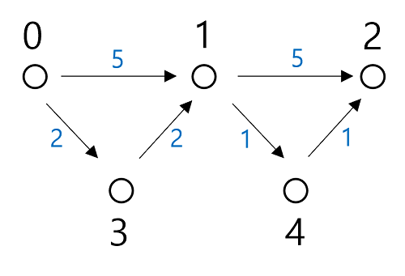
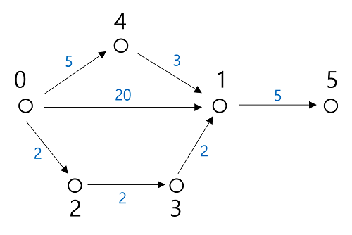

# LeetCode

## 787. Cheapest Flights With K Stops

다익스트라 알고리즘을 활용하되 약간의 변형을 적용해서 풀이했다.

다익스트라 알고리즘은 그리디 방식으로 풀이하면서 중복을 방지하기 위해 최소 거리를 찾은 정점에 대해서는 다시 탐색하지 않는다.

이번 문제에서는 정점을 거칠 수 있는 횟수 제한이 있기 때문에 목적지가 아닌 중간 정점에서 비용이 더 들더라도 탐색 횟수가 적은 탐색 경로도 포함해야 한다.

 

예를 들어 0에서 2로 가는 최소 비용을 구하는데 탐색 정점이 최대 2개라고 가정한다.

0에서 1까지의 최소 비용는 4다 (0 -> 3을 거쳐서 3 -> 1 로 가는 방법). 그러나 0에서 1로 직접 가는 경우 비용은 5라서 더 많이 들지만 정점을 하나 적게 탐색한다.

이 경우를 포함해야 문제에서 요구하는 정답을 구할 수 있다. 정답은 0 -> 1, 1 -> 4, 4 -> 2 로 가는 비용 7이다.

 

그래서 더 저렴한 비용인 경우만 우선순위 큐에 포함하는게 아니라 비용은 더 비싸더라도 탐색하는 정점이 적은 경우도 포함해서 구한다.

정점별로 탐색 횟수를 구하는 리스트 변수 cnt 를 두고 탐색 횟수가 cnt 에 있는 값보다 더 적은 경우 cnt 를갱신하고 우선순위 큐에 넣는다. 

주의할 점은 비용과 탐색이 and 가 아니라 or 조건으로 묶여있다. 탐색 횟수는 같거나 더 많지만 비용이 저렴한 경우도 해당 탐색 값으로 cnt 를 갱신한다. 이에 대해서는 아래의 예시를 통해 알 수 있다.

 

0에서 5로 가는 최소 비용을 구하되 최대 탐색 정점이 2개라고 가정한다.

0에서 1까지의 최소 비용은 0 -> 2, 2 -> 3, 3 -> 1 로 가는 경우다. 하지만 이 경우는 이미 탐색 정점이 3개가 돼서 정점 5까지 갈 수 없다. 그래서 0 -> 4, 4 -> 1 로 가는 경우도 포함될 수 있어야 한다. 

정점 1의 cnt 값은 먼저 0 -> 1로 가는 경우에 의해 20으로 갱신된다. 그리고 0 -> 2, 2 -> 3, 3 -> 1 로 가는 경우에 의해 2로 바뀐다. 이 경우가 바로 위에서 언급한 탐색 횟수는 많지만 비용이 저렴한 경우다. 이때 탐색 횟수를 2로 갱신해야 탐색 횟수가 더 작은 0 -> 4, 4 -> 1 경우도 우선순위 큐에 추가될 수 있다.

 

해당 문제는 교재의 풀이로는 시간 초과가 발생한다 (2023년 10월 27일 기준). 

이에 대해서 교재 github 페이지에 issue 로 등록이 되어 있고 해당 issue 에 저자가 아닌 다른 분이 코드를 공유 해주셔서 공유 해주신 코드를 참고했다.

 

<참고>

파이썬 알고리즘 인터뷰

[깃헙 이슈](https://github.com/onlybooks/python-algorithm-interview/issues/104)